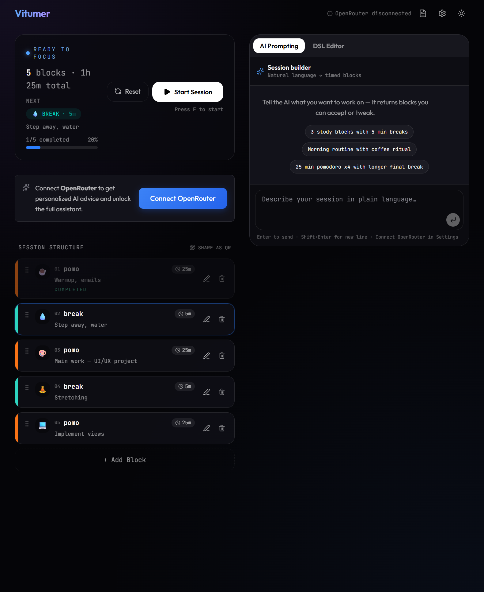

# Vitumer

**Structure your time with DSL or plain English — then run it as a focus timer.**

[](https://vitumer.jplucinski.dev/)
[](LICENSE)

Vitumer turns a time plan into a runnable session of timed blocks — Pomodoro, HIIT, morning rituals, Aeropress brews, whatever. Write a flow in a compact DSL, describe it in natural language (with optional AI), or click blocks together in the UI. Hit start, focus, share via URL or QR.



## Try it in 10 seconds

No install needed — open this Pomodoro session:

**[Start 3× Pomodoro →](https://vitumer.jplucinski.dev/?flow=MyAqICgyNW0gcG9tbyBbY29sb3I6b3JhbmdlXSArIDVtIGJyZWFrIFtjb2xvcjp0ZWFsXSk=)**

Or play with the [live demo](https://vitumer.jplucinski.dev/) and type something like *"3 study blocks with coffee breaks"* in the AI prompt.

## Features

- **Vitumer DSL** — Emmet-like syntax for time blocks: `3 * (25m pomo + 5m break)`
- **AI session builder** — describe a schedule in natural language (OpenRouter, optional)
- **Focus timer** — full-screen mode, skip/retry blocks, persists across refresh
- **Share flows** — export via URL (`?flow=`) or QR code
- **Themes** — Aura, Cyberpunk, Forest, Nord
- **PWA** — installable, works offline after first load

## Quick start

```bash
git clone https://github.com/jplucinski/vitumer.git
cd vitumer
npm install
npm run dev
```

Open http://localhost:5173

## Optional AI

Connect [OpenRouter](https://openrouter.ai) to generate sessions from natural language. Your API key stays in the browser — Vitumer has no backend.

## Tech stack

React 19 · Vite 8 · Tailwind CSS 4 · TypeScript · PWA

## Docs

- [DSL reference](https://vitumer.jplucinski.dev/docs/dsl/) — syntax and examples
- [llms.txt](https://vitumer.jplucinski.dev/llms.txt) — machine-readable docs for AI assistants

## Deploy

Static build — upload `dist/` to any static host (Netlify, Cloudflare Pages, S3, FTP, etc.):

```bash
npm run build   # output → dist/
```

[`vercel.json`](vercel.json) is included for Vercel / SPA rewrites. No runtime env vars required.

Optional GitHub Actions FTP deploy: copy [`.github/workflows/deploy.yml.example`](.github/workflows/deploy.yml.example) to `deploy.yml` and set secrets `FTP_HOST`, `FTP_USERNAME`, `FTP_PASSWORD`.

## For contributors / AI assistants

See [AGENTS.md](./AGENTS.md) for architecture, conventions, and agent guidelines.

## License

[MIT](LICENSE) © [jplucinski](https://github.com/jplucinski)
